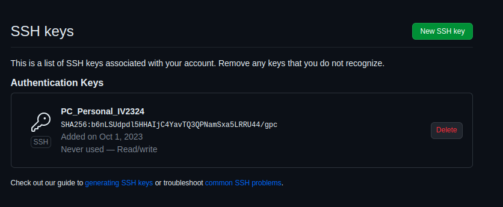
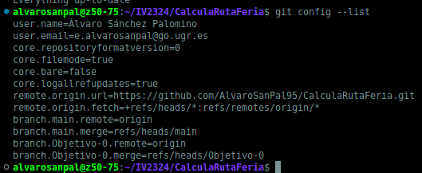

## Descripción del problema:

Un amigo con atracciones de feria, tiene el problema de no saber a que pueblos ir, de forma que no esté viajando demás y que pueda maximizar beneficios.
La idea es calcular una ruta optimizada analizando los datos disponibles, pudiendo predecir un mayor beneficio económico.

